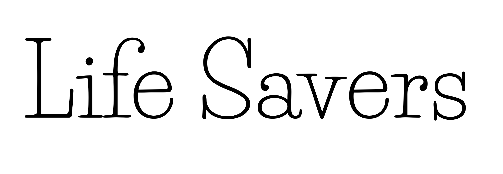
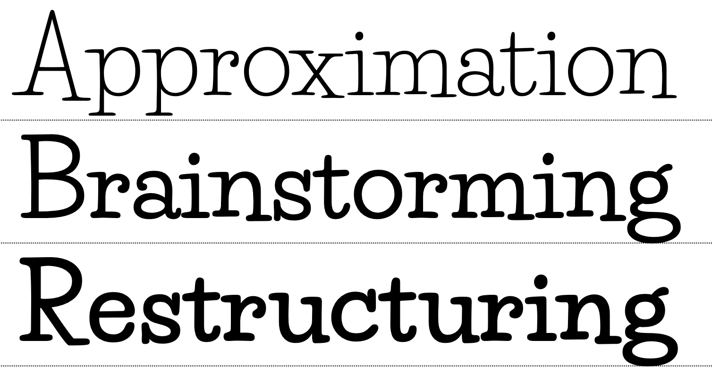

# Life Savers

[![][Fontbakery]](https://googlefonts.github.io/googlefonts-project-template/fontbakery/fontbakery-report.html)
[![][Universal]](https://googlefonts.github.io/googlefonts-project-template/fontbakery/fontbakery-report.html)
[![][GF Profile]](https://googlefonts.github.io/googlefonts-project-template/fontbakery/fontbakery-report.html)
[![][Shaping]](https://googlefonts.github.io/googlefonts-project-template/fontbakery/fontbakery-report.html)

[Fontbakery]: https://img.shields.io/endpoint?url=https%3A%2F%2Fraw.githubusercontent.com%2Fgooglefonts%2Fgooglefonts-project-template%2Fgh-pages%2Fbadges%2Foverall.json
[GF Profile]: https://img.shields.io/endpoint?url=https%3A%2F%2Fraw.githubusercontent.com%2Fgooglefonts%2Fgooglefonts-project-template%2Fgh-pages%2Fbadges%2FGoogleFonts.json
[Outline Correctness]: https://img.shields.io/endpoint?url=https%3A%2F%2Fraw.githubusercontent.com%2Fgooglefonts%2Fgooglefonts-project-template%2Fgh-pages%2Fbadges%2FOutlineCorrectnessChecks.json
[Shaping]: https://img.shields.io/endpoint?url=https%3A%2F%2Fraw.githubusercontent.com%2Fgooglefonts%2Fgooglefonts-project-template%2Fgh-pages%2Fbadges%2FShapingChecks.json
[Universal]: https://img.shields.io/endpoint?url=https%3A%2F%2Fraw.githubusercontent.com%2Fgooglefonts%2Fgooglefonts-project-template%2Fgh-pages%2Fbadges%2FUniversal.json

Do you remember the "Life Savers" candies adds from the 50s? That was a time when Ad Agencies actually hired Lettering Artist for they advertising text. Before the advent of Photo Typesetting, all the text was beautifully drawn by hand.

We are going to put some love to work and bring back the Life Savers hand-lettered Typewriter/Stymie mix. Probably drawn originally by Frazier Purdy for the Sam Marsh Studio.

Updated June 2019 to v3.001. The Bold weight was drawn in 2012 and added in December, and the ExtraBold weight was drawn in August 2013, and finally added to Google Fonts in June 2019 with minor technical adjustments.

## About

Pablo Impallari is Argentinian type designer based in Rosario.

## Building

Fonts are built automatically by GitHub Actions - take a look in the "Actions" tab for the latest build.

If you want to build fonts manually on your own computer:

* `make build` will produce font files.
* `make test` will run [FontBakery](https://github.com/googlefonts/fontbakery)'s quality assurance tests.
* `make proof` will generate HTML proof files.

The proof files and QA tests are also available automatically via GitHub Actions - look at `https://yourname.github.io/your-font-repository-name`.

## Changelog

### 13 June 2024. Version 3.100
- New repository / recreate sources (Emma Marichal)
- Fixes this issue: https://github.com/google/fonts/issues/1849

## License

This Font Software is licensed under the SIL Open Font License, Version 1.1.
This license is available with a FAQ at
https://openfontlicense.org

## Repository Layout

This font repository structure is inspired by [Unified Font Repository v0.3](https://github.com/unified-font-repository/Unified-Font-Repository), modified for the Google Fonts workflow.
